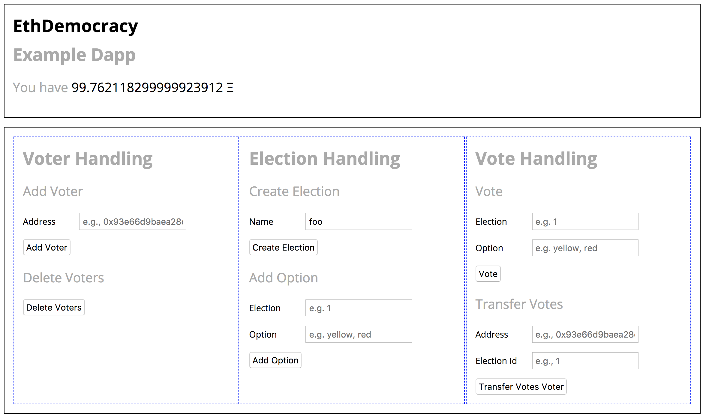

# EthDemocracy
This project is an unfinished smart contract for Ethereum that is used in trainings.

[](https://circleci.com/gh/chrisdotn/ethdemocracy/tree/master)

## Use Case
The project provides a stub for a smart contract that implements a simple _liquid democracy_ on the blockchain. The projects supplies tests for the stub that all fail initially. During the training we want to actually implement the contract so that the tests all succeed.



## Installation
To use the project, first clone the repository:
```Shell
$ git clone -b workshop https://github.com/chrisdotn/ethdemocracy.git
```

Then change into the directory and do a
```Shell
$ npm install
```
to install all needed dependencies and binaries.

## Usage
To develop with the project make sure to have [ganache-cli](https://github.com/trufflesuite/ganache-cli) running. It is installed by default and can be started by executing ``npm run ganache``.

After all packages have installed you can use the [truffle](http://truffleframework.com/) commands to interact with the project:
- `npm run compile` will compile smart contracts that have been changed since the last compile.
- `npm run compile --all` will compile all smart contracts.
- `npm run migrate` will compile smart contracts and deploy them to the default network.
- `npm run migrate --network staging` will compile and deploy to network staging.
- `npm run migrate --reset` will compile and deploy all smart contract even if they haven't changed.
- `npm run test` will run the tests in directory `$(PROJECT)/test`.
- `npm run test ./path/to/test/file.sol` will run the test in the specified file.
- `npm run console` will open a `web3`-enabled Javascript console for manual interaction with the contracts.

To interact with the frontend run the following commands in a different console tab:
- `npm run build` build the frontend using webpack
- `npm run dev` build the frontend using webpack and serve it to `localhost:8080`. This command will monitor changes to the frontend and redeploy if needed.
